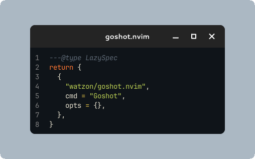

# goshot.nvim

A Neovim plugin for creating beautiful code screenshots using [goshot](https://github.com/watzon/goshot).

<div align="center">
    
</div>

## Installation

You should be able to install this plugin using your favorite package manager. For copy to clipboard to work, you may need to install `xclip`, `wl-clipboard`, or `pbcopy` on your system.

The plugin can automatically install the `goshot` binary for you, or you can install it manually and ensure it's in your `PATH`.

Using [lazy.nvim](https://github.com/folke/lazy.nvim):

```lua
{
    "watzon/goshot.nvim",
    cmd = "Goshot",
    opts = {
        binary = "goshot",     -- Path to goshot binary (default: "goshot")
        auto_install = false,  -- Automatically install goshot if not found (default: false)
    },
}
```

Using [packer.nvim](https://github.com/wbthomason/packer.nvim):

```lua
use({
    "watzon/goshot.nvim",
    cmd = "Goshot",
    config = function()
        require("goshot").setup({
            binary = "goshot",     -- Path to goshot binary (default: "goshot")
            auto_install = false,  -- Automatically install goshot if not found (default: false)
        })
    end,
})
```

## Commands

The plugin provides the following commands:

- `:Goshot [options]` - Create a screenshot of the current buffer or visual selection. Since it uses the `goshot` binary, any options supplied in your config file will be used, leading to more reproducible screenshots. See the [goshot wiki](https://github.com/watzon/goshot/wiki/Configuration) for more details.

- `:GoshotInstall` - Install or update the goshot binary. This will download the latest release from GitHub and install it in your Neovim data directory.

### Examples

```vim
" Create a screenshot of the entire buffer
:Goshot

" Create a screenshot with a specific theme
:Goshot -t dracula

" Create a screenshot with custom styling
:Goshot -t dracula --corner-radius 8 --background "#282a36"

" Create a screenshot of selected lines (in visual mode)
:'<,'>Goshot
```

### Visual Mode

You can use the `:Goshot` command in visual mode to capture only the selected lines. Simply:
1. Enter visual mode (`v`, `V`, or `<C-v>`)
2. Select the lines you want to capture
3. Type `:Goshot` (it will automatically add the `'<,'>` range)

The plugin will automatically pass the correct line range to goshot.

## Configuration

The plugin can be configured with the following options:

```lua
require("goshot").setup({
    -- Path to the goshot binary
    -- If not found in PATH and auto_install is true, will be installed automatically
    binary = "goshot",

    -- Whether to automatically install goshot if not found
    auto_install = false,
})
